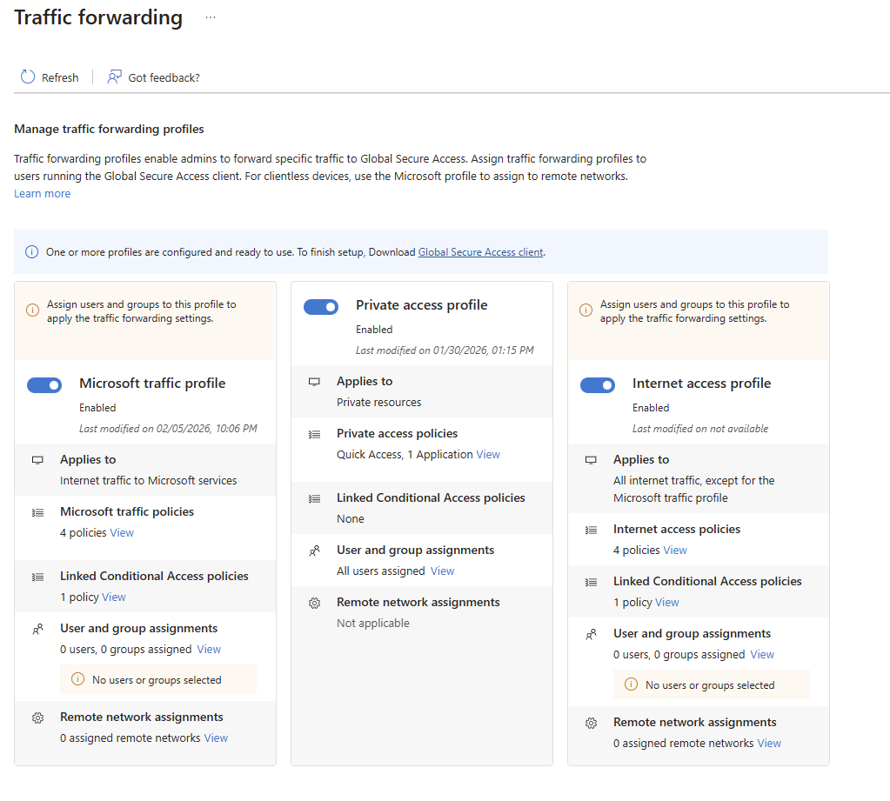
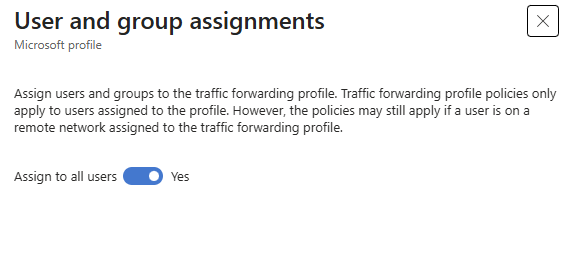
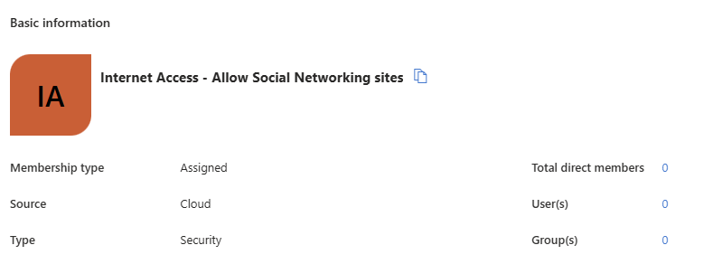
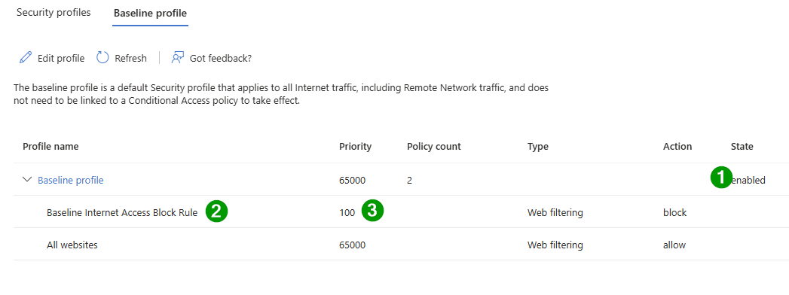

# Microsoft Entra Internet Access

## Overview

This folder contains presentation materials and demo instructions for **Microsoft Entra Internet Access**, a key component of **Microsoft Global Secure Access**.

## What is Microsoft Entra Internet Access?

Microsoft Entra Internet Access is a cloud-delivered Secure Web Gateway (SWG) solution that provides secure access to internet, SaaS, and Microsoft 365 resources. It's part of the Microsoft Global Secure Access platform, which converges network, identity, and endpoint security to enable Zero Trust access.

## Key Features

- **Secure Web Gateway**: Filter and control internet traffic with advanced threat protection
- **Conditional Access Integration**: Apply identity-driven access policies
- **Universal Tenant Restrictions**: Prevent data exfiltration to unauthorized tenants
- **Web Content Filtering**: Block access to risky or inappropriate websites
- **TLS Inspection**: Deep packet inspection for encrypted traffic

## Contents

This folder includes:

- Presentation slides covering Microsoft Entra Internet Access architecture, features, and use cases
- Step-by-step demo instructions for showcasing key capabilities
- Configuration guides and best practices

## Getting Started

Review the materials in this folder to prepare for demonstrations or presentations on Microsoft Entra Internet Access and its role in the broader Global Secure Access platform.

## Environment Setup

- [1. Enable Internet and M365 Traffic forwarding profiles](#1-enable-internet-and-microsoft-365-traffic-forwarding-profiles)
- [2. Assign Profiles to All users](#2-assign-profiles-for-all-users) 
- [3. Create security group for Social Networking sites](#3-create-security-group-for-internet-access)
- [4. Create a web content filtering policy with a restrictive baseline policy that blocks specific web categories and web destinations for all users.](#4-create-web-content-filting-policy)
- [5. Configure the existing baseline security profile](#5-configure-baseline-security-profile)
- [6. Create a web content filtering policies that allows social networking sites.](#6-create-a-web-content-filtering-policies-that-allows-social-networking-sites)
- [7. Create a a security profile that allows social networking sites](#7-create-a-security-profile-that-allows-social-networking-sites)
- [8. Create a CA policy](#8-create-a-conditional-access-policy-that-applies-to-certain-users)
- [9. Use ID Governance to allow users to request access to social networking sites](#9-use-id-governance-to-allow-users-to-request-access-to-social-networking-sites)
- [10. Create and link Conditional Access policies using the GSA security profile session control](#)

##

## Resources

- [Microsoft Global Secure Access Documentation](https://learn.microsoft.com/en-us/entra/global-secure-access/)
- [Microsoft Entra Internet Access Overview](https://learn.microsoft.com/en-us/entra/global-secure-access/concept-internet-access)

### 1. Enable Internet and Microsoft 365 Traffic forwarding profiles
Enabling this profile directs Global Secure Access clients to acquire traffic for this profile.
We recommend enabling the Microsoft traffic profile together with the Internet Access profile.

### 2. Assign profiles for all users

### 3. Create Security Group for Internet access
`Internet Access - Allow Social Networking sites`

### 4. Create web content filting policy

* **Name**: Baseline Internet Access Block Rule
* **Description**: Add a description
* **Action**: Block

### 5. Configure baseline security profile
1. Sign in to the Microsoft Entra admin center. Go to **Global Secure Access** > **Secure** > Security profiles.
2. Select **Baseline Profile**.
3. On **Basics**, set **State** to enabled.
4. Select **Save**.
5. On **Edit Baseline Profile**, select **Link policies**. Select **Link a policy**. Select **Existing policy**. Complete these fields:
    * Link a policy: Select Policy name and Baseline Internet Access Block Rule
    * Priority: 100
    * State: Enabled
6. Select Add.
7. On Create a profile > Link policies, confirm Baseline Internet Access Block Rule is listed.
8. Close the baseline security profile.

### 6. Create a web content filtering policies that allows social networking sites.

### 7. Create a security profile that allows social networking sites.

### 8. Create a Conditional Access policy that applies to certain users.

### 9. Use ID Governance to allow users to request access to social networking sites

### 

---

*Last Updated: February 2026*
